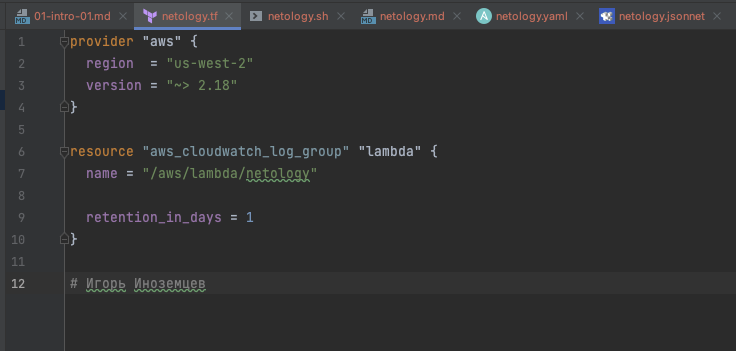
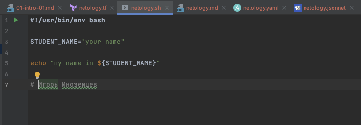
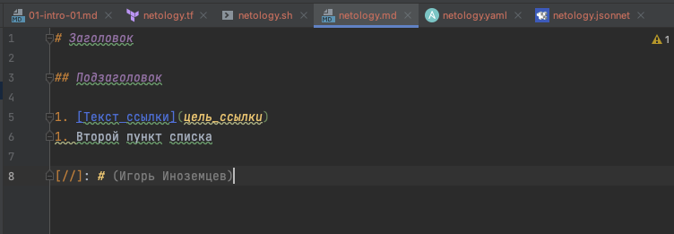
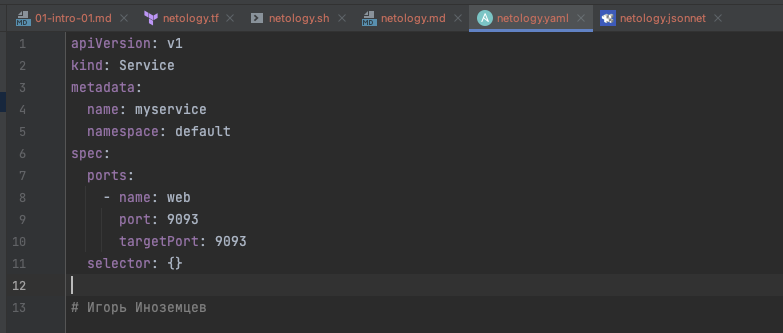
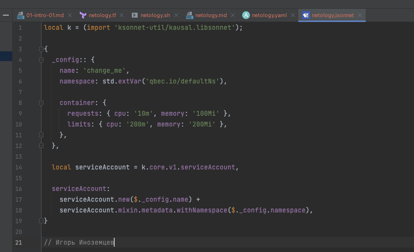
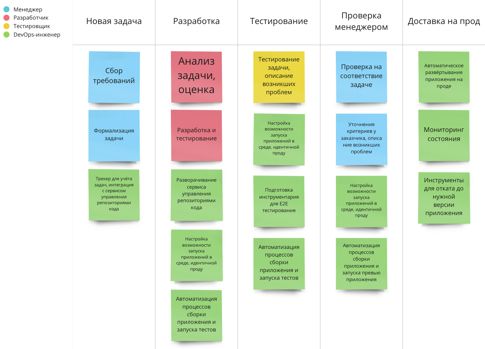

# Домашнее задание к занятию «1.1. Введение в DevOps»

## Задание №1 - Подготовка рабочей среды

### Terraform

### Bash

### Markdown

### Yaml

### Jsonnet

## Задание №2 - Описание жизненного цикла задачи (разработки нового функционала)

