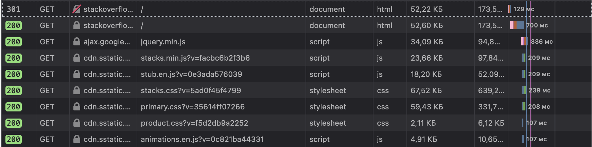
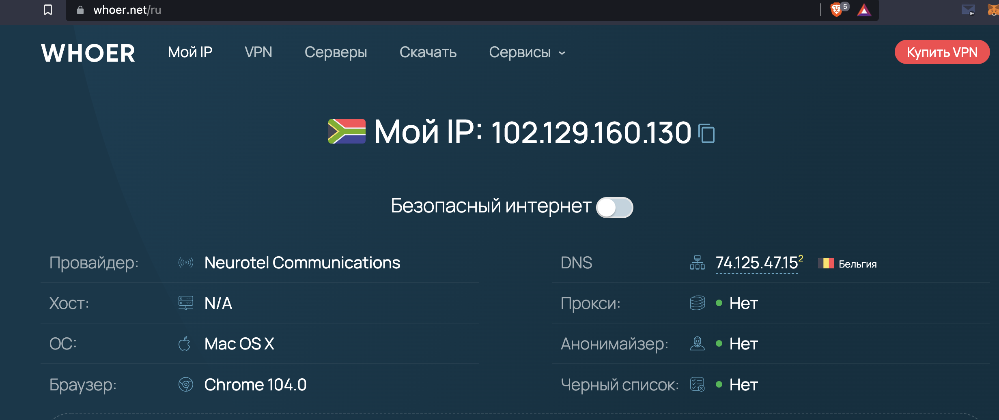

# Домашнее задание к занятию «3.6. Компьютерные сети, лекция 1»

1. Работа c HTTP через телнет.

- Подключитесь утилитой телнет к сайту stackoverflow.com `telnet stackoverflow.com 80`
- отправьте HTTP запрос

```shell
GET /questions HTTP/1.0
HOST: stackoverflow.com
[press enter]
[press enter]
```

- В ответе укажите полученный HTTP код, что он означает?

```shell
# 301 - код ответа HTTP, получаемый в ответ от сервера в ситуации, когда запрошенный ресурс был на постоянной основе перемещён в новое месторасположение, и указывающий на то, что текущие ссылки, использующие данный URL, должны быть обновлены
HTTP/1.1 301 Moved Permanently
Server: Varnish
Retry-After: 0
Location: https://stackoverflow.com/questions
Content-Length: 0
Accept-Ranges: bytes
Date: Mon, 19 Sep 2022 17:35:32 GMT
Via: 1.1 varnish
Connection: close
X-Served-By: cache-fra19135-FRA
X-Cache: HIT
X-Cache-Hits: 0
X-Timer: S1663608932.319341,VS0,VE0
Strict-Transport-Security: max-age=300
X-DNS-Prefetch-Control: off
```

2. Повторите задание 1 в браузере, используя консоль разработчика F12.

- откройте вкладку `Network`
- отправьте запрос http://stackoverflow.com
- найдите первый ответ HTTP сервера, откройте вкладку `Headers`
- укажите в ответе полученный HTTP код.
- проверьте время загрузки страницы, какой запрос обрабатывался дольше всего?
- приложите скриншот консоли браузера в ответ.

При запросе к http://stackoverflow.com был получен ответ с кодом 301, затем - с кодом 200 и контентом страницы.
Дольше всего обрабатывался запрос с контентом страницы.


3. Какой IP адрес у вас в интернете?


4. Какому провайдеру принадлежит ваш IP адрес? Какой автономной системе AS? Воспользуйтесь утилитой `whois`

`Neurotel Communications`

`AS9009`

5. Через какие сети проходит пакет, отправленный с вашего компьютера на адрес 8.8.8.8? Через какие AS? Воспользуйтесь
   утилитой `traceroute`

```shell
traceroute to 8.8.8.8 (8.8.8.8), 30 hops max, 60 byte packets
 1  10.0.2.2 [*]  0.135 ms  0.121 ms  0.219 ms
 2  192.168.1.1 [*]  2.451 ms  2.500 ms  2.547 ms
 3  10.22.5.3 [*]  3.260 ms  3.360 ms  4.080 ms
 4  185.1.160.11 [AS49869]  8.810 ms  8.801 ms  8.754 ms
 5  * 108.170.250.51 [AS15169]  43.677 ms *
 6  * 142.251.237.156 [AS15169]  20.863 ms 142.251.49.24 [AS15169]  20.810 ms
 7  172.253.66.108 [AS15169]  26.036 ms * *
 8  * * *
 9  * * *
10  * * *
11  * * *
12  * * *
13  * * *
14  * * *
15  * * *
16  * * *
17  * * *
18  8.8.8.8 [AS15169]  37.708 ms *  22.093 ms
```

6. Повторите задание 5 в утилите `mtr`. На каком участке наибольшая задержка - delay?
```shell
1. AS???    10.0.2.2         0.0%    13    0.2   0.2   0.1   0.3   0.0
 2. AS???    192.168.1.1     8.3%    13    4.6  22.5   1.6 107.6  42.0
 3. AS???    10.22.5.3      16.7%    13    2.2   8.1   1.9  50.9  15.1
 4. AS???    185.1.160.11    0.0%    13    7.5   9.7   3.3  46.3  12.0
 5. AS15169  108.170.250.51 30.8%    13  119.9  20.9   4.2 119.9  37.7
 6. AS15169  72.14.234.20   38.5%    13   64.0  25.8  18.7  64.0  15.6
 7. AS15169  72.14.232.76    7.7%    13   27.2  23.5  18.1  40.0   6.9
 8. AS15169  172.253.64.55   7.7%    13   26.9  23.4  20.1  30.1   3.8
 9. (waiting for reply)
10. (waiting for reply)
11. (waiting for reply)
12. (waiting for reply)
13. (waiting for reply)
14. (waiting for reply)
15. (waiting for reply)
16. (waiting for reply)
17. (waiting for reply)
18. AS15169  8.8.8.8          0.0%    12   26.3  28.6  18.5 101.8  24.5
```
наибольшая задержка на 5 этапе.

7. Какие DNS сервера отвечают за доменное имя dns.google? Какие A записи? воспользуйтесь утилитой `dig`

DNS сервера:
```shell
ns1.zdns.google
ns2.zdns.google
ns3.zdns.google
ns4.zdns.google
```
A записи:
```shell
8.8.8.8
8.8.4.4
```

8. Проверьте PTR записи для IP адресов из задания 7. Какое доменное имя привязано к IP? воспользуйтесь утилитой `dig`
```shell
dig -x 8.8.8.8
PTR	dns.google.
```