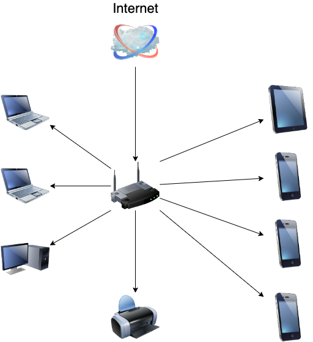

# Домашнее задание к занятию «3.8. Компьютерные сети, лекция 3»

1. Подключитесь к публичному маршрутизатору в интернет. Найдите маршрут к вашему публичному IP.

```shell
telnet route-views.routeviews.org
Username: rviews
show ip route x.x.x.x/32
show bgp x.x.x.x/32
```

```shell
route-views>show ip route 102.129.160.52
Routing entry for 102.129.160.0/24
  Known via "bgp 6447", distance 20, metric 0
  Tag 6939, type external
  Last update from 64.71.137.241 5w1d ago
  Routing Descriptor Blocks:
  * 64.71.137.241, from 64.71.137.241, 5w1d ago
      Route metric is 0, traffic share count is 1
      AS Hops 2
      Route tag 6939
      MPLS label: none
      
      
route-views>show bgp 102.129.160.52
BGP routing table entry for 102.129.160.0/24, version 2386102745
Paths: (22 available, best #22, table default)
  Not advertised to any peer
  Refresh Epoch 1
  4901 6079 3257 9009
    162.250.137.254 from 162.250.137.254 (162.250.137.254)
      Origin IGP, localpref 100, valid, external
      Community: 65000:10100 65000:10300 65000:10400
      path 7FE16CF5F0E8 RPKI State valid
      rx pathid: 0, tx pathid: 0
  Refresh Epoch 1
  3267 3356 3257 9009
    194.85.40.15 from 194.85.40.15 (185.141.126.1)
      Origin IGP, metric 0, localpref 100, valid, external
      path 7FE0D6860588 RPKI State valid
      rx pathid: 0, tx pathid: 0
  Refresh Epoch 1
  8283 57866 6830 9009
    94.142.247.3 from 94.142.247.3 (94.142.247.3)
      Origin IGP, metric 0, localpref 100, valid, external
      Community: 6830:17000 6830:17458 6830:23001 6830:34405 8283:15 8283:102 57866:501
      unknown transitive attribute: flag 0xE0 type 0x20 length 0x18
        value 0000 205B 0000 0005 0000 0002 0000 205B
              0000 0006 0000 000F
      path 7FE18C8A7A48 RPKI State valid
      rx pathid: 0, tx pathid: 0
  Refresh Epoch 1
  20130 6939 9009
    140.192.8.16 from 140.192.8.16 (140.192.8.16)
      Origin IGP, localpref 100, valid, external
      path 7FE140AE4EF0 RPKI State valid
      rx pathid: 0, tx pathid: 0
  Refresh Epoch 1
  20912 3257 9009
    212.66.96.126 from 212.66.96.126 (212.66.96.126)
      Origin IGP, localpref 100, valid, external
      Community: 3257:4000 3257:8049 3257:50001 3257:50110 3257:53300 3257:53301 20912:65004
      path 7FE182DC5588 RPKI State valid
      rx pathid: 0, tx pathid: 0
  Refresh Epoch 1
  49788 12552 9009
    91.218.184.60 from 91.218.184.60 (91.218.184.60)
      Origin IGP, localpref 100, valid, external
      Community: 12552:12000 12552:12600 12552:12601 12552:22000
      Extended Community: 0x43:100:1
      path 7FE131773368 RPKI State valid
      rx pathid: 0, tx pathid: 0
  Refresh Epoch 1
  3333 1103 20562 9009
    193.0.0.56 from 193.0.0.56 (193.0.0.56)
      Origin IGP, localpref 100, valid, external
      Community: 20562:32 20562:3049 20562:4969 20562:65000 20562:65044
      path 7FE0F7EA1A90 RPKI State valid
      rx pathid: 0, tx pathid: 0
```

2. Создайте dummy0 интерфейс в Ubuntu. Добавьте несколько статических маршрутов. Проверьте таблицу маршрутизации.

```shell
> sudo modprobe -v dummy numdummies=2

> ip a show type dummy
3: dummy0: <BROADCAST,NOARP> mtu 1500 qdisc noop state DOWN group default qlen 1000
    link/ether 46:aa:1f:ca:f1:33 brd ff:ff:ff:ff:ff:ff
4: dummy1: <BROADCAST,NOARP> mtu 1500 qdisc noop state DOWN group default qlen 1000
    link/ether 86:09:76:86:b1:2d brd ff:ff:ff:ff:ff:ff
    
> sudo ip addr add 192.168.1.150/24 dev dummy0
> sudo ip addr add 192.168.1.150/24 dev eth0
> ip -br route
default via 10.0.2.2 dev eth0 proto dhcp src 10.0.2.15 metric 100
10.0.2.0/24 dev eth0 proto kernel scope link src 10.0.2.15
10.0.2.2 dev eth0 proto dhcp scope link src 10.0.2.15 metric 100
192.168.1.0/24 dev eth0 proto kernel scope link src 192.168.1.150
```

3. Проверьте открытые TCP порты в Ubuntu, какие протоколы и приложения используют эти порты? Приведите несколько
   примеров.
```shell
> sudo ss -ltpn
State        Recv-Q       Send-Q             Local Address:Port              Peer Address:Port       Process
LISTEN       0            4096               127.0.0.53%lo:53                     0.0.0.0:*           users:(("systemd-resolve",pid=619,fd=13))
LISTEN       0            128                      0.0.0.0:22                     0.0.0.0:*           users:(("sshd",pid=673,fd=3))
LISTEN       0            128                         [::]:22                        [::]:*           users:(("sshd",pid=673,fd=4))


Используются порты 53 и 22 - DNS и SSH
```

4. Проверьте используемые UDP сокеты в Ubuntu, какие протоколы и приложения используют эти порты?

```shell
> sudo ss -lupn
State        Recv-Q       Send-Q              Local Address:Port             Peer Address:Port       Process
UNCONN       0            0                   127.0.0.53%lo:53                    0.0.0.0:*           users:(("systemd-resolve",pid=619,fd=12))
UNCONN       0            0                  10.0.2.15%eth0:68                    0.0.0.0:*           users:(("systemd-network",pid=617,fd=19))


Используются порты 53 и 68 - DNS и Bootstrap protocol client.
```

5. Используя diagrams.net, создайте L3 диаграмму вашей домашней сети или любой другой сети, с которой вы работали.

