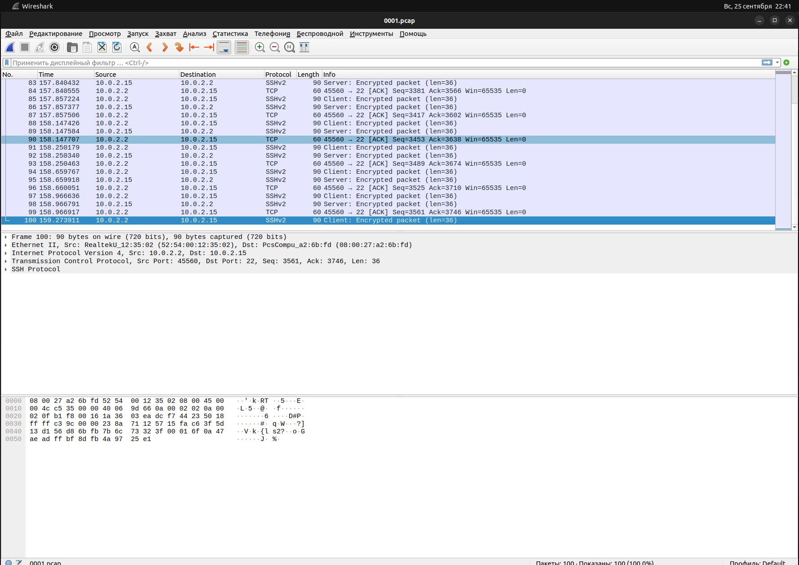

# Домашнее задание к занятию «3.9. Элементы безопасности информационных систем»

1. Установите Bitwarden плагин для браузера. Зарегистрируйтесь и сохраните несколько паролей.

2. Установите Google authenticator на мобильный телефон. Настройте вход в Bitwarden аккаунт через Google authenticator
   OTP.

3. Установите apache2, сгенерируйте самоподписанный сертификат, настройте тестовый сайт для работы по HTTPS.

```shell
# Apache работает
vagrant@vagrant:~$ sudo systemctl status apache2
● apache2.service - The Apache HTTP Server
     Loaded: loaded (/lib/systemd/system/apache2.service; enabled; vendor preset: enabled)
     Active: active (running) since Sun 2022-09-25 18:39:58 UTC; 10s ago
       Docs: https://httpd.apache.org/docs/2.4/
    Process: 63206 ExecStart=/usr/sbin/apachectl start (code=exited, status=0/SUCCESS)
   Main PID: 63220 (apache2)
      Tasks: 55 (limit: 1066)
     Memory: 6.0M
     CGroup: /system.slice/apache2.service
             ├─63220 /usr/sbin/apache2 -k start
             ├─63221 /usr/sbin/apache2 -k start
             └─63222 /usr/sbin/apache2 -k start

Sep 25 18:39:58 vagrant systemd[1]: Starting The Apache HTTP Server...
Sep 25 18:39:58 vagrant apachectl[63219]: AH00558: apache2: Could not reliably determine the server's fully qualified domain name, using 127.0.1.1>
Sep 25 18:39:58 vagrant systemd[1]: Started The Apache HTTP Server.
```

```shell
# Сгенерировал ключ
vagrant@vagrant:~$ sudo openssl req -x509 -nodes -days 365 -newkey rsa:2048 -keyout /etc/ssl/private/local.key -out /etc/ssl/certs/local.crt
```

```shell
# Сконфигурировал тестовый сайт и создал страницу
vagrant@vagrant:~$ cat /etc/apache2/sites-available/10.0.2.15.conf
<VirtualHost *:443>
   ServerName 10.0.2.15
   DocumentRoot /var/www/10.0.2.15

   SSLEngine on
   SSLCertificateFile /etc/ssl/certs/local.crt
   SSLCertificateKeyFile /etc/ssl/private/local.key
</VirtualHost>

vagrant@vagrant:~$ cat /var/www/10.0.2.15/index.html
<h1>Hello, Netology!</h1>

# Проверяю доступ
vagrant@vagrant:~$ curl --insecure -v https://10.0.2.15
*   Trying 10.0.2.15:443...
* TCP_NODELAY set
* Connected to 10.0.2.15 (10.0.2.15) port 443 (#0)
* ALPN, offering h2
* ALPN, offering http/1.1
* successfully set certificate verify locations:
*   CAfile: /etc/ssl/certs/ca-certificates.crt
  CApath: /etc/ssl/certs
* TLSv1.3 (OUT), TLS handshake, Client hello (1):
* TLSv1.3 (IN), TLS handshake, Server hello (2):
* TLSv1.3 (IN), TLS handshake, Encrypted Extensions (8):
* TLSv1.3 (IN), TLS handshake, Certificate (11):
* TLSv1.3 (IN), TLS handshake, CERT verify (15):
* TLSv1.3 (IN), TLS handshake, Finished (20):
* TLSv1.3 (OUT), TLS change cipher, Change cipher spec (1):
* TLSv1.3 (OUT), TLS handshake, Finished (20):
* SSL connection using TLSv1.3 / TLS_AES_256_GCM_SHA384
* ALPN, server accepted to use http/1.1
* Server certificate:
*  subject: C=RU; ST=MD; L=I; O=Com; OU=CM; CN=10.0.2.15; emailAddress=test@test.ru
*  start date: Sep 25 19:04:27 2022 GMT
*  expire date: Sep 25 19:04:27 2023 GMT
*  issuer: C=RU; ST=MD; L=I; O=Com; OU=CM; CN=10.0.2.15; emailAddress=test@test.ru
*  SSL certificate verify result: self signed certificate (18), continuing anyway.
> GET / HTTP/1.1
> Host: 10.0.2.15
> User-Agent: curl/7.68.0
> Accept: */*
>
* TLSv1.3 (IN), TLS handshake, Newsession Ticket (4):
* TLSv1.3 (IN), TLS handshake, Newsession Ticket (4):
* old SSL session ID is stale, removing
* Mark bundle as not supporting multiuse
< HTTP/1.1 200 OK
< Date: Sun, 25 Sep 2022 19:07:43 GMT
< Server: Apache/2.4.41 (Ubuntu)
< Last-Modified: Sun, 25 Sep 2022 19:06:52 GMT
< ETag: "1a-5e9851d2967d6"
< Accept-Ranges: bytes
< Content-Length: 26
< Content-Type: text/html
<
<h1>Hello, Netology!</h1>
* Connection #0 to host 10.0.2.15 left intact
```

4. Проверьте на TLS уязвимости произвольный сайт в интернете (кроме сайтов МВД, ФСБ, МинОбр, НацБанк, РосКосмос,
   РосАтом, РосНАНО и любых госкомпаний, объектов КИИ, ВПК ... и тому подобное).

```shell
vagrant@vagrant:~/testssl.sh$ ./testssl.sh -U --sneaky https://otus.ru

###########################################################
    testssl.sh       3.2rc1 from https://testssl.sh/dev/
    (33376cc 2022-09-18 21:50:30)

      This program is free software. Distribution and
             modification under GPLv2 permitted.
      USAGE w/o ANY WARRANTY. USE IT AT YOUR OWN RISK!

       Please file bugs @ https://testssl.sh/bugs/

###########################################################

 Using "OpenSSL 1.0.2-bad (1.0.2k-dev)" [~183 ciphers]
 on vagrant:./bin/openssl.Linux.x86_64
 (built: "Sep  1 14:03:44 2022", platform: "linux-x86_64")


Testing all IPv4 addresses (port 443): 188.114.98.202 188.114.99.202
------------------------------------------------
 Start 2022-09-25 19:10:36        -->> 188.114.98.202:443 (otus.ru) <<--

 Further IP addresses:   188.114.99.202 2a06:98c1:3123:c000::a
                         2a06:98c1:3122:c000::a
 rDNS (188.114.98.202):  --
 Service detected:       HTTP


 Testing vulnerabilities

 Heartbleed (CVE-2014-0160)                not vulnerable (OK), no heartbeat extension
 CCS (CVE-2014-0224)                       not vulnerable (OK)
 Ticketbleed (CVE-2016-9244), experiment.  not vulnerable (OK)
 ROBOT                                     not vulnerable (OK)
 Secure Renegotiation (RFC 5746)           supported (OK)
 Secure Client-Initiated Renegotiation     not vulnerable (OK)
 CRIME, TLS (CVE-2012-4929)                not vulnerable (OK)
 BREACH (CVE-2013-3587)                    potentially NOT ok, "br gzip" HTTP compression detected. - only supplied "/" tested
                                           Can be ignored for static pages or if no secrets in the page
 POODLE, SSL (CVE-2014-3566)               not vulnerable (OK)
 TLS_FALLBACK_SCSV (RFC 7507)              Downgrade attack prevention supported (OK)
 SWEET32 (CVE-2016-2183, CVE-2016-6329)    not vulnerable (OK)
 FREAK (CVE-2015-0204)                     not vulnerable (OK)
 DROWN (CVE-2016-0800, CVE-2016-0703)      not vulnerable on this host and port (OK)
                                           make sure you don't use this certificate elsewhere with SSLv2 enabled services, see
                                           https://search.censys.io/search?resource=hosts&virtual_hosts=INCLUDE&q=D9C1DEE2DB4DEC2DEEF62FF1D0EE2F2FF486EBB29E66F514802F3C9CA5F64D0E
 LOGJAM (CVE-2015-4000), experimental      not vulnerable (OK): no DH EXPORT ciphers, no DH key detected with <= TLS 1.2
 BEAST (CVE-2011-3389)                     not vulnerable (OK), no SSL3 or TLS1
 LUCKY13 (CVE-2013-0169), experimental     potentially VULNERABLE, uses cipher block chaining (CBC) ciphers with TLS. Check patches
 Winshock (CVE-2014-6321), experimental    not vulnerable (OK)
 RC4 (CVE-2013-2566, CVE-2015-2808)        no RC4 ciphers detected (OK)


 Done 2022-09-25 19:11:11 [  38s] -->> 188.114.98.202:443 (otus.ru) <<--

------------------------------------------------
 Start 2022-09-25 19:11:13        -->> 188.114.99.202:443 (otus.ru) <<--

 Further IP addresses:   188.114.98.202 2a06:98c1:3123:c000::a
                         2a06:98c1:3122:c000::a
 rDNS (188.114.99.202):  --
 Service detected:       HTTP


 Testing vulnerabilities

 Heartbleed (CVE-2014-0160)                not vulnerable (OK), no heartbeat extension
 CCS (CVE-2014-0224)                       not vulnerable (OK)
 Ticketbleed (CVE-2016-9244), experiment.  not vulnerable (OK)
 ROBOT                                     not vulnerable (OK)
 Secure Renegotiation (RFC 5746)           supported (OK)
 Secure Client-Initiated Renegotiation     not vulnerable (OK)
 CRIME, TLS (CVE-2012-4929)                not vulnerable (OK)
 BREACH (CVE-2013-3587)                    potentially NOT ok, "br gzip" HTTP compression detected. - only supplied "/" tested
                                           Can be ignored for static pages or if no secrets in the page
 POODLE, SSL (CVE-2014-3566)               not vulnerable (OK)
 TLS_FALLBACK_SCSV (RFC 7507)              Downgrade attack prevention supported (OK)
 SWEET32 (CVE-2016-2183, CVE-2016-6329)    not vulnerable (OK)
 FREAK (CVE-2015-0204)                     not vulnerable (OK)
 DROWN (CVE-2016-0800, CVE-2016-0703)      not vulnerable on this host and port (OK)
                                           make sure you don't use this certificate elsewhere with SSLv2 enabled services, see
                                           https://search.censys.io/search?resource=hosts&virtual_hosts=INCLUDE&q=D9C1DEE2DB4DEC2DEEF62FF1D0EE2F2FF486EBB29E66F514802F3C9CA5F64D0E
 LOGJAM (CVE-2015-4000), experimental      not vulnerable (OK): no DH EXPORT ciphers, no DH key detected with <= TLS 1.2
 BEAST (CVE-2011-3389)                     not vulnerable (OK), no SSL3 or TLS1
 LUCKY13 (CVE-2013-0169), experimental     potentially VULNERABLE, uses cipher block chaining (CBC) ciphers with TLS. Check patches
 Winshock (CVE-2014-6321), experimental    not vulnerable (OK)
 RC4 (CVE-2013-2566, CVE-2015-2808)        no RC4 ciphers detected (OK)


 Done 2022-09-25 19:11:49 [  76s] -->> 188.114.99.202:443 (otus.ru) <<--

------------------------------------------------
Done testing now all IP addresses (on port 443): 188.114.98.202 188.114.99.202
```

5. Установите на Ubuntu ssh сервер, сгенерируйте новый приватный ключ. Скопируйте свой публичный ключ на другой сервер.
   Подключитесь к серверу по SSH-ключу.

```shell
# Установил и активировал ssh сервер
vagrant@vagrant:~$ sudo apt install openssh-server
vagrant@vagrant:~$ systemctl start sshd.service
vagrant@vagrant:~$ systemctl enable sshd.service
vagrant@vagrant:~$ systemctl status sshd.service
● ssh.service - OpenBSD Secure Shell server
     Loaded: loaded (/lib/systemd/system/ssh.service; enabled; vendor p>
     Active: active (running) since Sun 2022-09-25 18:33:11 UTC; 43min >
       Docs: man:sshd(8)
             man:sshd_config(5)
   Main PID: 918 (sshd)
      Tasks: 1 (limit: 1066)
     Memory: 5.3M
     CGroup: /system.slice/ssh.service
             └─918 sshd: /usr/sbin/sshd -D [listener] 0 of 10-100 start>

Sep 25 18:33:51 vagrant sshd[12788]: Accepted publickey for vagrant fro>
Sep 25 18:33:51 vagrant sshd[12788]: pam_unix(sshd:session): session op>
Sep 25 18:56:44 vagrant sshd[63542]: Accepted publickey for vagrant fro>
Sep 25 18:56:44 vagrant sshd[63542]: pam_unix(sshd:session): session op>
Sep 25 18:58:46 vagrant sshd[63597]: Accepted publickey for vagrant fro>
Sep 25 18:58:46 vagrant sshd[63597]: pam_unix(sshd:session): session op>
Sep 25 19:00:25 vagrant sshd[63660]: Accepted publickey for vagrant fro>
Sep 25 19:00:25 vagrant sshd[63660]: pam_unix(sshd:session): session op>
Sep 25 19:02:55 vagrant sshd[63731]: Accepted publickey for vagrant fro>
Sep 25 19:02:55 vagrant sshd[63731]: pam_unix(sshd:session): session op>
```

```shell
# Сгенерировал ключ
vagrant@vagrant:~$ ssh-keygen
Generating public/private rsa key pair.
Enter file in which to save the key (/home/vagrant/.ssh/id_rsa):
Enter passphrase (empty for no passphrase):
Enter same passphrase again:
Your identification has been saved in /home/vagrant/.ssh/id_rsa
Your public key has been saved in /home/vagrant/.ssh/id_rsa.pub
The key fingerprint is:
SHA256:LhihvAdvZ3V8gK6LJqO9szg4H1MYrJfGUavRGYgyO9o vagrant@vagrant
The key's randomart image is:
+---[RSA 3072]----+
| . .o            |
|+..o +   .       |
|.o= =   . .      |
|o+ O . . . .     |
|oo@ o   S o .    |
|.oE= o + . .     |
|. + = = .        |
|+o+=.+ o         |
|o==B. .          |
+----[SHA256]-----+
```

```shell
# Скопировал ключ и подключился к машине
vagrant@vagrant:~$ ssh-copy-id vagrant@10.0.0.5
vagrant@vagrant:~$ ssh vagrant@10.0.0.5
```

6. Переименуйте файлы ключей из задания 5. Настройте файл конфигурации SSH клиента, так чтобы вход на удаленный сервер
   осуществлялся по имени сервера.

```shell
vagrant@vagrant:~$ mv /home/vagrant/.ssh/id_rsa /home/vagrant/.ssh/second_rsa
vagrant@vagrant:~$ touch ~/.ssh/config && chmod 600 ~/.ssh/config
vagrant@vagrant:~$ cat .ssh/config
Host second
     HostName 10.0.0.5
     User vagrant
     IdentityFile ~/.ssh/second_rsa
```

7. Соберите дамп трафика утилитой tcpdump в формате pcap, 100 пакетов. Откройте файл pcap в Wireshark.

```shell
vagrant@vagrant:~$ sudo tcpdump -c 100 -w 0001.pcap -i eth0
tcpdump: listening on eth0, link-type EN10MB (Ethernet), capture size 262144 bytes
100 packets captured
102 packets received by filter
0 packets dropped by kernel
```

